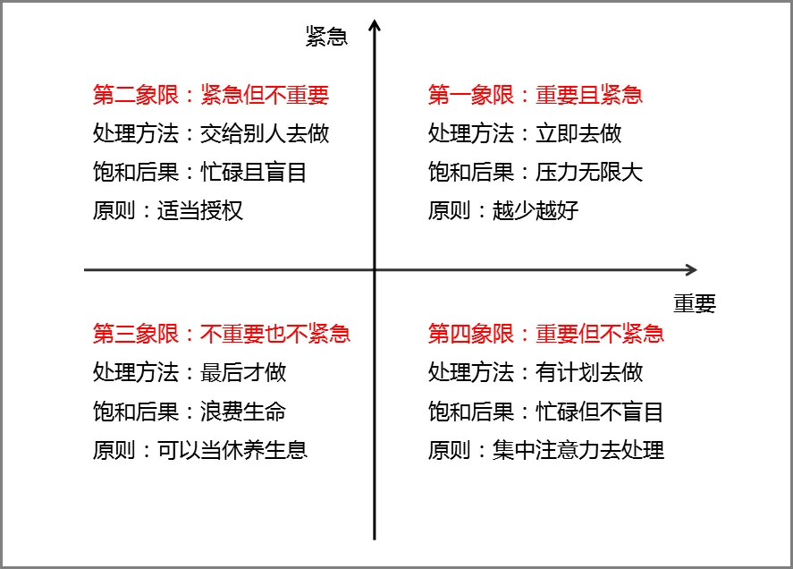

# GTD时间管理法

- GTD就是Getting Things Done的缩写，意思是“把需要做的事情处理好”。
- GTD的核心理念概括就是必须记录下来所有要做的事，然后整理安排并使自己一一去执行。
- GTD的五个核心原则是：**收集、整理、组织、执行、回顾**。
## 收集

- 收集指，把任何需要跟踪处理的事情都放在“收集箱”，用外接硬盘去处理，而不是用自己的大脑去处理信息。
- 特别提醒，这里的事物收集包含所有需要处理的事情。
- 最简单的收集方式就是把能够想到的所有事情全部列举并记录下来，可以用记事本，时间积木，TODO等办公软件处理。

## 整理

- 整理指，将收集到的东西按照**两分钟原则**、**四象限整理法**、**1-3-5规则**分类。

### 两分钟原则

- 任何事情如果花的时间少于两分钟，那么马上就去做。两分钟是一个分水岭，这样的时间和正式地推迟一个动作所花的时间差不多。

### 四象限整理法

